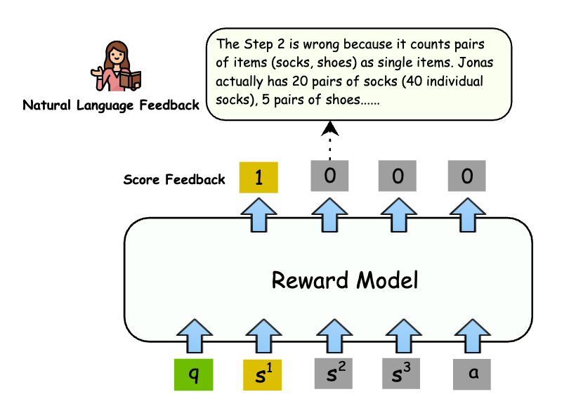
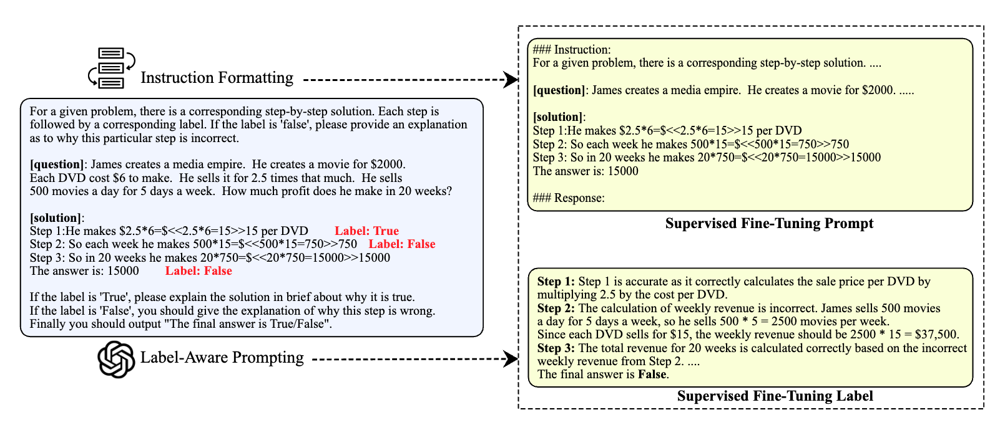
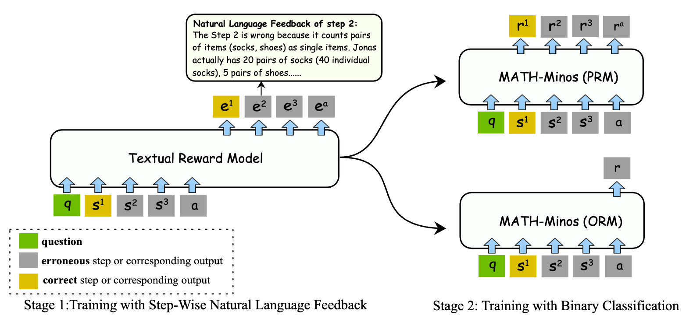
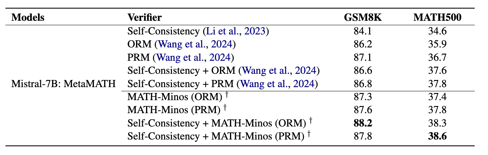

# Math - Minos


Official repository for the paper "[The Reason behind Good or Bad: Towards a Better Mathematical Verifier
with Natural Language Feedback](https://arxiv.org/pdf/2406.14024)".

<p align="center">
     <br>
</p>

## News


- [2024-06-29] Our codebase is released now!

- [2024-06-20] Our Math - Minos paper is available at [ARXIV](https://arxiv.org/pdf/2406.14024)!

## Method

### Data Construction

<p align="center">
     <br>
</p>

### Two-Stage Training

<p align="center">
     <br>
</p>


## Performence

<p align="center">
     <br>
</p>


## Requirements


```python
transformers>=4.34.0
wandb==0.15.3
torch>=2.1.0
```

##  Set Up

```python
git clone https://github.com/KbsdJames/MATH-Minos.git
cd MATH-Minos
pip install -r requirements.txt .
```

## Training
### Train a textual rm

```python
bash train_reward_7b.sh
```

### Train an outcome reward model

```python
cd RM/
bash job_orm.sh
```
### Train a process reward model

```python
cd RM/
bash job_prm.sh
```
## Inference


```python
cd RM/
bash inference_job.sh

cd ../evaluation/
python eval_gsm8k.py
python eval_math.py
```


## Citation

If you find **MATH-Minos** useful for your research and applications, please kindly cite using this BibTeX:

```latex
@misc{gao2024reasongoodbadbetter,
      title={The Reason behind Good or Bad: Towards a Better Mathematical Verifier with Natural Language Feedback}, 
      author={Bofei Gao and Zefan Cai and Runxin Xu and Peiyi Wang and Ce Zheng and Runji Lin and Keming Lu and Junyang Lin and Chang Zhou and Tianyu Liu and Baobao Chang},
      year={2024},
      eprint={2406.14024},
      archivePrefix={arXiv},
      primaryClass={cs.CL},
      url={https://arxiv.org/abs/2406.14024}, 
}
```
